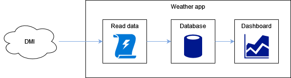

# Weather dashboard app

This project is a multi-container Docker application that acquires, processes and visualizes weather observation data.

## Components

### Reading data

This image is defined in the `read-data` folder. The container gets raw weather observation data from the [Danish Meteorological Institute (DMI) API](https://confluence.govcloud.dk/display/FDAPI/Meteorological+Observation). It then structures the data in a table and writes to a database. To schedule the reading/writing I'm using [Prefect](https://www.prefect.io/). Prefect is a Python dataflow automation framework. The tasks are set to run once per hour. The code expects an API key in the api-key.txt file.

### Database

For this component I am using a MySQL image. I'm using the `dump/dump.sql` file to define the required table.

### Dashboard

The dashboard code and Dockerfile are in the `dashboard` folder. This component is a web app created with [Plotly Dash](https://plotly.com/dash/).

## Installation

To build images and start the containers run the following command:

`sudo docker compose -f weather-app.yaml up`

The dashboard web app will be running on the IP of the machine the container is running, on port 7080.